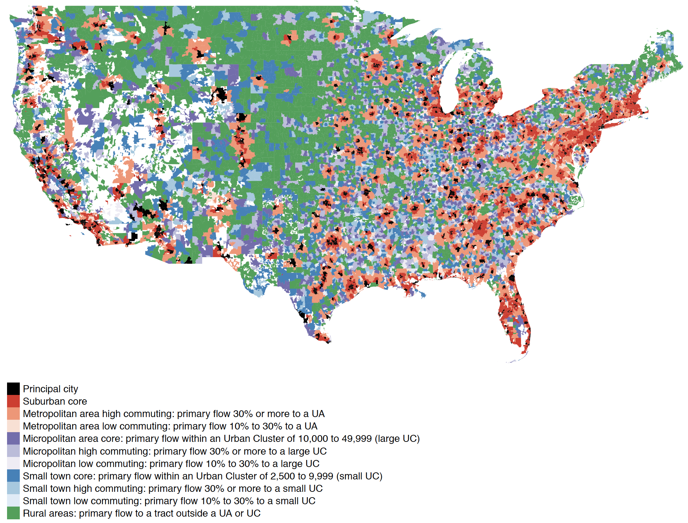

Modified RUCA codes that distinguish between cities and suburbs
================
John Johnson
9/11/2020

[Rural-Urban Commuting Area
Codes](https://www.ers.usda.gov/data-products/rural-urban-commuting-area-codes/)
(RUCA) are created by the USDA to “classify U.S. census tracts using
measures of population density, urbanization, and daily commuting.” The
USDA also provides a zip code-based RUCA file. These are particularly
useful for public opinion researchers who know an interview respondent’s
zipcode but possibly little other geographic information.

The basic RUCA codes use a single code for [urbanized
areas](https://www.census.gov/programs-surveys/geography/about/faq/2010-urban-area-faq.html)–a
broad Census Bureau designation which includes basically all the
built-up parts of a Metropolitan Statistical Area. Public opinion
researchers typically want to distinguish between “urban” and “suburban”
communities, both of which are included in the Census definition of
“urbanized areas” and thus also RUCA code \#1.

To solve this problem, I create an additional code for “principal
cities.” Using the [Missouri Census Data Center’s Geographic
Correspondence
Engine](http://mcdc.missouri.edu/applications/geocorr2014.html), I
created a population-weighted crosswalk between ZCTAs (zip codes) and
the census-designated [principal cities of metropolitan statistical
areas](https://www.census.gov/geographies/reference-files/time-series/demo/metro-micro/delineation-files.html)
(as of 2020). I exclude the principal cities of *micro*politan
statistical areas.

A zip code which meets the following to conditions is classified as a
“principal city zip.” It must (1) be classified as RUCA code 1
(metropolitan core) ***and*** (2) a majority of its population must
reside in a principal city.

The resulting zipcode-to-modified-RUCA file is available to [download at
this
link](https://github.com/jdjohn215/modified-RUCA-codes/raw/master/Modified_RUCA_Zip_Codes_2010.csv).
The zipcode to principal cities crosswalk is available in the
`source-data` folder of this repository.

The modified RUCA file also includes additional suggested summary
classifications combining multiple existing codes.

Here is a table showing the codes along with the number of zipcodes and
total national
population.

| ruca\_new | label\_new                                                                                  | ruca6                 | ruca5                | zips   | population  |
| --------: | :------------------------------------------------------------------------------------------ | :-------------------- | :------------------- | :----- | :---------- |
|         0 | Principal city                                                                              | Principal city        | Principal city       | 4,889  | 138,081,616 |
|         1 | Suburban core                                                                               | Suburban core         | Suburban core        | 11,816 | 107,970,142 |
|         2 | Metropolitan area high commuting: primary flow 30% or more to a UA                          | Exurbs                | Exurbs               | 7,050  | 26,168,232  |
|         3 | Metropolitan area low commuting: primary flow 10% to 30% to a UA                            | Exurbs                | Exurbs               | 898    | 2,143,212   |
|         4 | Micropolitan area core: primary flow within an Urban Cluster of 10,000 to 49,999 (large UC) | Large towns (10-50k)  | Large towns (10-50k) | 2,205  | 22,453,157  |
|         5 | Micropolitan high commuting: primary flow 30% or more to a large UC                         | Large towns (10-50k)  | Large towns (10-50k) | 2,789  | 5,192,965   |
|         6 | Micropolitan low commuting: primary flow 10% to 30% to a large UC                           | Large towns (10-50k)  | Large towns (10-50k) | 636    | 1,113,485   |
|         7 | Small town core: primary flow within an Urban Cluster of 2,500 to 9,999 (small UC)          | Small towns (2.5-10k) | Rural (less than 10k | 2,042  | 11,252,065  |
|         8 | Small town high commuting: primary flow 30% or more to a small UC                           | Small towns (2.5-10k) | Rural (less than 10k | 1,378  | 1,933,200   |
|         9 | Small town low commuting: primary flow 10% to 30% to a small UC                             | Small towns (2.5-10k) | Rural (less than 10k | 538    | 816,103     |
|        10 | Rural areas: primary flow to a tract outside a UA or UC                                     | Isolated rural        | Rural (less than 10k | 6,903  | 9,127,889   |
